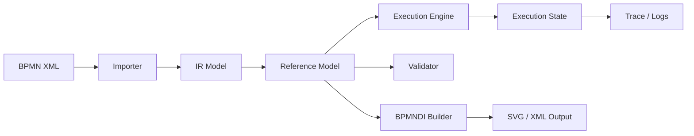

# BPMN Reference Engine – Handoff Document (v31)

## 1. What is BPMN?

**Business Process Model and Notation (BPMN)** is a standardized graphical notation for modeling business processes. It allows both technical and non-technical stakeholders to understand workflows.

### Core Idea
BPMN describes:
- **Activities** (work being done)
- **Events** (things that happen)
- **Gateways** (decisions / parallelism)
- **Flows** (control movement)
- **Participants** (who is involved)

### Typical Use Cases
- Workflow automation (WES, ERP, BPM systems)
- Integration orchestration
- Simulation and optimization
- Documentation of business processes

---

## 2. Core BPMN Concepts

### Flow Elements
- StartEvent / EndEvent
- Tasks (Service, User, Script…)
- Gateways (XOR, AND, OR, Event-based)

### Advanced Concepts
- Subprocesses
- Transactions & Compensation
- Event Subprocesses
- Multi-instance activities
- Call Activities

### Communication
- Message Flows
- Signals
- Events (timer, error, escalation…)

### Diagram Layer (BPMNDI)
- Shapes (nodes)
- Edges (flows)
- Labels
- Bounds & Waypoints

---

## 3. What Has Been Built (v31)

### Overview

```text
v26 → Reference Model
v27 → Token Model
v28 → Event Semantics
v29 → Advanced Process Types
v30 → BPMNDI Completion
v31 → Execution Semantics
```

### Result

A **full BPMN reference engine skeleton** consisting of:

- Parser (XML → IR)
- Model Adapter (IR → Reference Model)
- Execution Engine (Token-based)
- Event System
- BPMNDI Renderer
- Validation Layer

---

## 4. Command Reference

### Core

| Command | Description |
|--------|------------|
| `npm run reference:v31:all` | Runs full pipeline |
| `npm run verify:v31` | Full integrity + validation |

### Execution

| Command | Description |
|--------|------------|
| `execution:model` | Outputs execution model |
| `execution:validate:semantics` | Validates BPMN for execution |
| `execution:simulate:strong` | Full BPMN simulation from XML |
| `execution:simulate:ir` | Simulation from IR |

### BPMNDI

| Command | Description |
|--------|------------|
| `di:export:complete` | Generate BPMN + DI |
| `di:import:complete` | Parse DI |
| `di:validate` | Validate DI |
| `di:roundtrip` | Import/export test |

### Advanced

| Command | Description |
|--------|------------|
| `advanced:simulate` | Advanced process simulation |
| `advanced:validate` | Validate advanced structures |

---

## 5. Mermaid Architecture Overview



---

## 6. Software Architecture

### 6.1 Import Layer
- Converts BPMN XML into IR
- Handles parsing of all BPMN elements

### 6.2 Reference Model Layer
- Normalized BPMN structure
- Ensures consistency and validation

### 6.3 Execution Layer (v31)
Core runtime:
- Token handling
- Scope handling
- Event handling
- Gateway logic

### 6.4 Event System
- Message
- Timer
- Error
- Escalation
- Compensation

### 6.5 BPMNDI Layer
- Layout generation
- Shape/edge mapping
- Import/export compatibility

### 6.6 CLI Layer
- Unified entry points
- Testing + validation pipelines

---

## 7. What Works

✔ Full BPMN parsing  
✔ Token-based execution  
✔ Gateways (XOR, AND, OR basic)  
✔ Event handling (basic)  
✔ Multi-instance execution (simplified)  
✔ Call activity execution (simplified)  
✔ BPMNDI roundtrip  

---

## 8. What Is Missing (Critical)

### Execution Semantics Gaps

- Inclusive gateway **correct join logic**
- Event-based gateway **real race behavior**
- Boundary events **full interruption handling**
- Event subprocess **runtime execution**
- Compensation **real rollback logic**
- Transactions **ACID-like behavior**

### Runtime Gaps

- No persistence layer
- No distributed execution
- No real scheduler
- No message broker integration

### Data Layer

- No real expression engine
- No FEEL support
- No data mapping

---

## 9. Final Assessment

### What this is

```text
✔ Reference BPMN Engine (high-level)
✔ Architecture-complete
✔ Fully extensible
```

### What this is NOT

```text
✘ Production BPM engine
✘ Fully BPMN-compliant execution engine
✘ Distributed runtime
```

---

## 10. Handoff Summary

This system provides a **complete architectural foundation** for:

- BPMN execution engines
- WES orchestration layer
- Process simulation tools

### Next Steps

1. Execution semantics completion (strict BPMN spec)
2. Persistence layer
3. Job scheduling system
4. Message/event infrastructure
5. Conformance test suite

---

## Conclusion

The system is now:

```text
~70% of a full BPMN engine
100% of a strong reference architecture
```

This is the correct point for **productization or specialization**.
